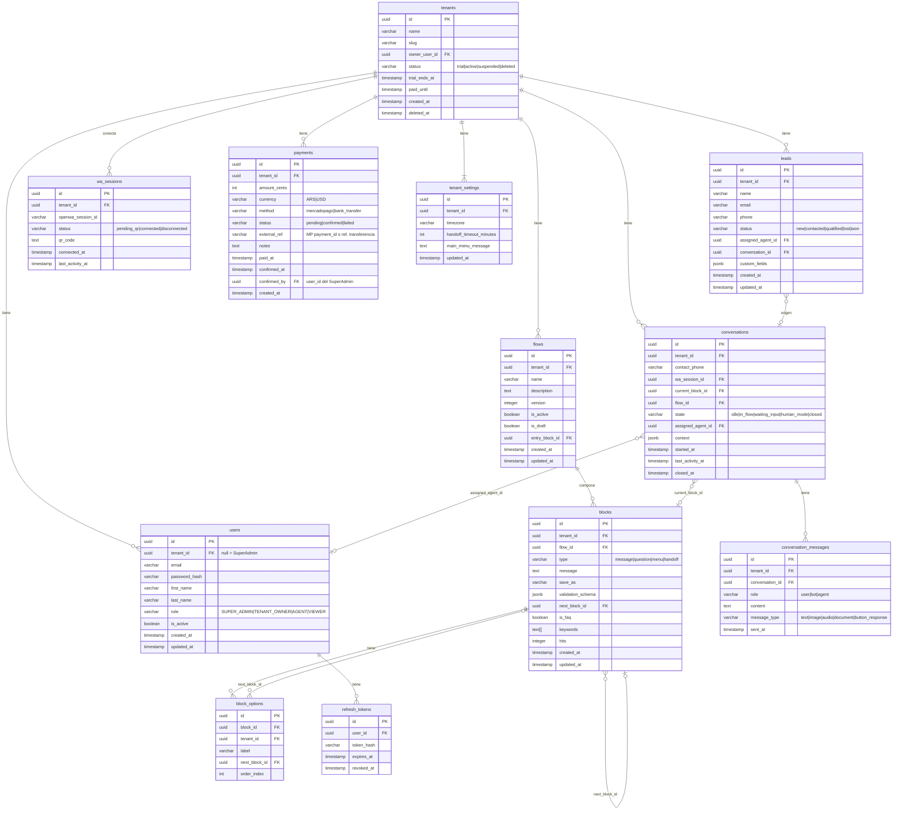

# Converxa — Documento Técnico de Arquitectura

> **Nombre del producto:** Converxa (provisional).
> **Tipo de documento:** Especificación técnica y contrato de implementación.
> **Audiencia:** Desarrollo, revisores de código.
> **Versión:** 2.0 — Simplificado para desarrollo individual.
> **Estado:** Aprobado.
>
> **Cómo leer este documento:** es un contrato de implementación. Las decisiones definidas aquí son ejecutables. Cualquier desviación debe documentarse en una ADR dentro de `docs/adr/`.

---

## Tabla de Contenidos

1. [Resumen ejecutivo técnico](#1-resumen-ejecutivo-técnico)
2. [Principios arquitectónicos](#2-principios-arquitectónicos)
3. [Vista de arquitectura](#3-vista-de-arquitectura)
4. [Stack tecnológico](#4-stack-tecnológico)
5. [Estructura de monorepo](#5-estructura-de-monorepo)
6. [Módulos del backend](#6-módulos-del-backend)
7. [Frontend: Next.js 16](#7-frontend-nextjs-16)
8. [Multi-tenancy: Row-Level Security](#8-multi-tenancy-row-level-security)
9. [Autenticación y autorización](#9-autenticación-y-autorización)
10. [Integración con OpenWA](#10-integración-con-openwa)
11. [Motor conversacional](#11-motor-conversacional)
12. [Modelo de datos](#12-modelo-de-datos)
13. [Procesamiento asíncrono](#13-procesamiento-asíncrono)
14. [Billing: MercadoPago + transferencia bancaria](#14-billing-mercadopago--transferencia-bancaria)
15. [Seguridad](#15-seguridad)
16. [Observabilidad](#16-observabilidad)
17. [Testing](#17-testing)
18. [CI/CD y Deploy](#18-cicd-y-deploy)
19. [Variables de entorno](#19-variables-de-entorno)
20. [Decisiones cerradas](#20-decisiones-cerradas)

---

## 1. Resumen ejecutivo técnico

**Converxa** es una plataforma SaaS multi-tenant construida por un solo desarrollador. El backend está en **NestJS** con una arquitectura en capas simple (controller → service → repository), persistiendo en **PostgreSQL** con **Row-Level Security** para aislar datos entre tenants. La mensajería se desacopla detrás de un puerto `MessagingPort` implementado por **OpenWA** (sidecar HTTP). El frontend es **Next.js 16.2.7** con App Router, **shadcn/ui** y **TanStack Query**. Las colas asíncronas usan **BullMQ** sobre **Redis**. El billing usa **MercadoPago** para pagos online y confirmación manual para transferencias bancarias.

**Prioridades de diseño:**

- Simplicidad sobre sofisticación: código directo, sin abstracciones innecesarias.
- Aislamiento de datos estricto entre tenants (RLS).
- Desacoplamiento del gateway de WhatsApp (cambiar de OpenWA no toca el dominio).
- Construible y mantenible por una sola persona.

---

## 2. Principios arquitectónicos

### 2.1 Arquitectura en capas

Cada módulo sigue una estructura simple de **3 capas**:

```
Controller  → recibe HTTP, valida DTO, llama al service
Service     → lógica de negocio, orquesta repositorios
Repository  → acceso a datos (TypeORM)
```

Sin DDD táctico, sin aggregates, sin domain events. Entidades TypeORM directas.

### 2.2 Inversión de dependencias para puertos externos

Los servicios externos (OpenWA, MercadoPago, email) se definen como interfaces (puertos). La implementación concreta se inyecta vía NestJS DI. Esto permite mockear en tests y cambiar de proveedor sin tocar la lógica.

```
MessagingPort  →  OpenWaAdapter (default) | MockAdapter (tests)
PaymentPort    →  MercadoPagoAdapter
EmailPort      →  SmtpAdapter (default) | MockAdapter (tests)
```

### 2.3 Convenciones de código

- **Carpetas:** kebab-case (`flows-editor/`).
- **Archivos:** kebab-case (`blocks.service.ts`).
- **Clases:** PascalCase (`BlocksService`).
- **Funciones/variables:** camelCase (`getBlocksByTenant`).
- **Constantes:** UPPER_SNAKE_CASE (`MAX_BLOCKS_PER_FLOW`).
- **Tablas BD:** snake_case plural (`blocks`, `conversations`).
- **Columnas BD:** snake_case (`tenant_id`, `next_block_id`).
- **Endpoints REST:** kebab-case plural (`/api/v1/flows`, `/api/v1/flow-blocks`).

---

## 3. Vista de arquitectura

```
[Usuario WhatsApp]
       │
       ▼
[OpenWA sidecar] ──webhook──> [Converxa API (NestJS)]
                                         │
[Cliente del SaaS] ──browser──> [Converxa Web (Next.js 16)]
                                         │
                          ┌──────────────┼──────────────┐
                          ▼              ▼              ▼
                    [PostgreSQL]      [Redis]       [MercadoPago]
                     (RLS ON)       (BullMQ)
```

**Componentes:**

| Componente | Puerto | Notas |
|---|---|---|
| Converxa API | 3000 | NestJS REST |
| Converxa Web | 3001 | Next.js 16 |
| OpenWA | 2785 | Sidecar HTTP |
| PostgreSQL | 5432 | Con RLS |
| Redis | 6379 | Cache + BullMQ |
| MinIO (dev) | 9000 | S3-compatible para media |
| Mailhog (dev) | 1025/8025 | SMTP local |

---

## 4. Stack tecnológico

### 4.1 Backend

| Componente | Tecnología |
|---|---|
| Lenguaje | TypeScript 5.x strict |
| Framework | NestJS 10.x |
| ORM | TypeORM 0.3.x |
| Base de datos | PostgreSQL 16 con RLS |
| Cache / colas | Redis 7 + BullMQ 5 |
| Validación | Zod 3.x |
| Auth | jsonwebtoken (RS256) |
| Hashing | Argon2id |
| Logging | Pino 9.x |
| Error tracking | Sentry |
| Tests | Vitest 1.x |
| Documentación API | @nestjs/swagger + OpenAPI 3.1 |

### 4.2 Frontend

| Componente | Tecnología |
|---|---|
| Framework | Next.js 16.2.7 (App Router) |
| Lenguaje | TypeScript 5.x strict |
| UI | shadcn/ui + Radix UI + Tailwind CSS |
| Estado servidor | TanStack Query 5.x |
| Estado cliente | Zustand 4.x |
| Formularios | react-hook-form + Zod |
| Editor de flujos | React Flow 11.x |
| i18n | next-intl (estructura ready, español por defecto) |
| Tests | Vitest + Testing Library |

### 4.3 Infraestructura

| Componente | Tecnología |
|---|---|
| Gateway WhatsApp | OpenWA v0.1.6 (Node 22, sidecar HTTP) |
| Pagos | MercadoPago SDK Node.js |
| Storage media | S3-compatible (MinIO en dev, producción a definir) |
| Email | Nodemailer (Mailhog en dev, SMTP en prod) |
| Monorepo | Bun workspaces |
| CI/CD | GitHub Actions |
| Deploy | Docker Compose en VPS |

---

## 5. Estructura de monorepo

```
converxa/
├── apps/
│   ├── api/                      # Backend NestJS
│   │   ├── src/
│   │   │   ├── main.ts
│   │   │   ├── app.module.ts
│   │   │   ├── shared/           # código compartido entre módulos
│   │   │   │   ├── database/     # datasource, base repo, RLS middleware
│   │   │   │   ├── guards/       # JwtAuthGuard, RolesGuard
│   │   │   │   ├── filters/      # GlobalExceptionFilter
│   │   │   │   ├── pipes/        # ZodValidationPipe
│   │   │   │   └── decorators/   # @CurrentUser, @Roles, @Public
│   │   │   └── modules/
│   │   │       ├── auth/         # usuarios, login, JWT
│   │   │       ├── tenants/      # gestión de clientes y suscripción
│   │   │       ├── messaging/    # OpenWA, webhooks
│   │   │       └── flows/        # motor conversacional, bloques, leads, FAQs
│   │   ├── test/
│   │   ├── migrations/
│   │   ├── package.json
│   │   └── Dockerfile
│   └── web/                      # Frontend Next.js 16
│       ├── src/
│       │   ├── app/
│       │   │   ├── (auth)/       # login, register
│       │   │   ├── (dashboard)/  # rutas del cliente
│       │   │   └── (superadmin)/ # rutas del owner
│       │   ├── components/
│       │   ├── features/
│       │   │   ├── flows-editor/
│       │   │   ├── conversations/
│       │   │   ├── leads/
│       │   │   ├── faqs/
│       │   │   ├── analytics/
│       │   │   └── billing/
│       │   ├── lib/
│       │   └── i18n/
│       ├── package.json
│       └── Dockerfile
├── packages/
│   ├── types/                    # tipos compartidos FE/BE (DTOs, enums)
│   └── config/                   # ESLint, Prettier, TS base config
├── docker/
│   ├── docker-compose.dev.yml
│   └── docker-compose.yml
├── docs/
│   └── adr/                      # Architecture Decision Records
├── .github/workflows/
├── package.json                  # workspace root
└── bun.lock
```

---

## 6. Módulos del backend

### 6.1 Anatomía de un módulo

```
modules/auth/
├── auth.module.ts          # composition root (NestJS @Module)
├── auth.controller.ts      # HTTP: valida DTO, llama al service
├── auth.service.ts         # lógica de negocio
├── auth.repository.ts      # acceso a datos con TypeORM
├── entities/
│   ├── user.entity.ts
│   └── refresh-token.entity.ts
└── dto/
    ├── login.dto.ts
    └── register.dto.ts
```

### 6.2 Módulo `auth`

**Responsabilidad:** gestionar usuarios, credenciales, roles, sesiones JWT.

**Entidades:**
- `User` (id, email, passwordHash, firstName, lastName, role, tenantId, isActive)
- `RefreshToken` (id, userId, tokenHash, expiresAt, revokedAt)

**Endpoints:**
- `POST /api/v1/auth/register` — registro de nuevo tenant + owner
- `POST /api/v1/auth/login` — login, devuelve access + refresh token
- `POST /api/v1/auth/refresh` — rota el access token
- `POST /api/v1/auth/logout` — revoca el refresh token
- `POST /api/v1/auth/invite` — TenantOwner invita a un Agent/Viewer

**Decisiones:**
- JWT RS256, access token 15 min, refresh token 7 días.
- Refresh tokens hasheados en DB (no en texto plano).
- Roles: `SUPER_ADMIN`, `TENANT_OWNER`, `AGENT`, `VIEWER`.

### 6.3 Módulo `tenants`

**Responsabilidad:** CRUD de tenants, configuración, ciclo de vida y billing.

**Entidades:**
- `Tenant` (id, name, slug, ownerUserId, status, trialEndsAt, paidUntil, createdAt)
- `TenantSettings` (id, tenantId, timezone, handoffTimeoutMinutes)
- `Payment` (id, tenantId, amount, method, status, confirmedAt, externalRef, notes)

**Endpoints:**
- `GET /api/v1/tenants` — SuperAdmin: lista todos los tenants
- `GET /api/v1/tenants/:id` — detalle de un tenant
- `PATCH /api/v1/tenants/:id` — actualizar configuración
- `POST /api/v1/tenants/:id/activate` — SuperAdmin activa un tenant
- `POST /api/v1/tenants/:id/suspend` — SuperAdmin suspende un tenant
- `POST /api/v1/tenants/:id/payments` — SuperAdmin registra pago manual
- `GET /api/v1/tenants/me/settings` — configuración del tenant autenticado

**Estados del tenant:**

```
trial → active (pago confirmado)
      → suspended (trial vencido o pago vencido)
      → deleted (30 días después de suspendido, soft delete)
```

**Cron:** diario a las 02:00 UTC revisa `paid_until < now()` y `trial_ends_at < now()` y suspende los correspondientes.

### 6.4 Módulo `messaging`

**Responsabilidad:** encapsular la comunicación con OpenWA.

**Puerto (interfaz):**

```typescript
interface MessagingPort {
  createSession(input: { name: string }): Promise<{ sessionId: string }>;
  startSession(sessionId: string): Promise<void>;
  getQrCode(sessionId: string): Promise<{ qrCode: string }>;
  getSessionStatus(sessionId: string): Promise<SessionStatus>;
  sendText(input: { sessionId: string; to: string; text: string }): Promise<void>;
  sendButtons(input: { sessionId: string; to: string; text: string; buttons: string[] }): Promise<void>;
  setWebhook(sessionId: string, config: WebhookConfig): Promise<void>;
}
```

**Entidad:**
- `WaSession` (id, tenantId, openwaSessionId, status, qrCode, connectedAt)

**Endpoints:**
- `POST /api/v1/messaging/sessions` — inicia una sesión WhatsApp para el tenant
- `GET /api/v1/messaging/sessions/me` — estado de la sesión del tenant
- `POST /api/v1/messaging/sessions/me/reconnect` — reconectar
- `POST /api/v1/webhooks/openwa` — webhook entrante de OpenWA (público, validado por HMAC)

**Webhook entrante:** el controller valida la firma HMAC-SHA256, devuelve 200 inmediatamente y delega el procesamiento a la cola `webhook-process` de BullMQ.

**Eventos manejados desde OpenWA:**
- `message.received` → dispara el motor conversacional.
- `session.status` → actualiza el estado y el QR en la tabla `wa_sessions`.
- `message.ack` → actualiza el estado de entrega del mensaje.

### 6.5 Módulo `flows`

**Responsabilidad:** motor conversacional, bloques, FAQs, leads y métricas básicas.

Este módulo concentra el núcleo del producto.

**Entidades:**
- `Flow` (id, tenantId, name, version, isActive, isDraft, entryBlockId)
- `Block` (id, tenantId, flowId, type, message, saveAs, nextBlockId, isFaq, keywords, hits)
- `BlockOption` (id, blockId, label, nextBlockId)
- `Conversation` (id, tenantId, contactPhone, waSessionId, currentBlockId, flowId, state, assignedAgentId, context JSONB, startedAt, lastActivityAt, closedAt)
- `ConversationMessage` (id, tenantId, conversationId, role, content, messageType, sentAt)
- `Lead` (id, tenantId, name, email, phone, source, status, assignedAgentId, conversationId, customFields JSONB)
- `Faq` (id, tenantId, blockId — alias de bloque con isFaq=true)

**Estados de conversación:** `idle` | `in_flow` | `waiting_input` | `human_mode` | `closed`

**Tipos de bloque:** `MESSAGE` | `QUESTION` | `MENU` | `HANDOFF`

**Endpoints principales:**

```
Flujos:
GET    /api/v1/flows
POST   /api/v1/flows
PUT    /api/v1/flows/:id
DELETE /api/v1/flows/:id
POST   /api/v1/flows/:id/publish
GET    /api/v1/flows/:id/validate

Bloques:
GET    /api/v1/flows/:flowId/blocks
POST   /api/v1/flows/:flowId/blocks
PUT    /api/v1/flows/:flowId/blocks/:id
DELETE /api/v1/flows/:flowId/blocks/:id

Conversaciones:
GET    /api/v1/conversations
GET    /api/v1/conversations/:id
POST   /api/v1/conversations/:id/assign
POST   /api/v1/conversations/:id/close
POST   /api/v1/conversations/simulate  # debug: simula mensaje entrante

Leads:
GET    /api/v1/leads
PATCH  /api/v1/leads/:id

FAQs:
GET    /api/v1/faqs
POST   /api/v1/faqs
PUT    /api/v1/faqs/:id
DELETE /api/v1/faqs/:id

Métricas:
GET    /api/v1/analytics/summary
```

---

## 7. Frontend: Next.js 16

### 7.1 Estructura de rutas

```
apps/web/src/app/
├── (auth)/
│   ├── login/page.tsx
│   ├── register/page.tsx
│   └── forgot-password/page.tsx
├── (dashboard)/
│   ├── layout.tsx                    # layout autenticado: sidebar + topbar
│   ├── page.tsx                      # overview / home
│   ├── flows/
│   │   ├── page.tsx                  # lista de flujos
│   │   └── [id]/edit/page.tsx        # editor visual
│   ├── conversations/
│   │   ├── page.tsx
│   │   └── [id]/page.tsx
│   ├── leads/
│   │   ├── page.tsx
│   │   └── [id]/page.tsx
│   ├── faqs/page.tsx
│   ├── analytics/page.tsx
│   ├── users/page.tsx
│   └── settings/
│       ├── page.tsx
│       └── whatsapp/page.tsx         # conexión WhatsApp (QR)
└── (superadmin)/
    ├── layout.tsx                    # solo accesible con rol SUPER_ADMIN
    ├── page.tsx                      # dashboard del owner
    ├── tenants/page.tsx              # lista de clientes
    └── tenants/[id]/page.tsx         # detalle + confirmar pagos
```

### 7.2 Estado y datos

- **TanStack Query** para todo el estado de servidor (cache, revalidación, optimistic updates).
- **Zustand** para estado de UI puro (estado del editor de flujos, filtros de tabla).
- **react-hook-form + Zod** para formularios con validación.

### 7.3 Editor de flujos (React Flow)

- Nodos custom: `MessageNode`, `QuestionNode`, `MenuNode`, `HandoffNode`.
- Panel lateral de propiedades al seleccionar un nodo.
- Validación visual: ciclos en rojo, nodos inalcanzables con opacidad reducida.
- Botón "Publicar" que transiciona el flujo de borrador a activo.
- Autosave con debounce de 2 segundos, guarda solo sobre el **borrador** (no sobre el flujo publicado).

### 7.4 Flujo draft vs. publicado

Los flujos tienen dos estados: `isDraft: true` (en edición) y `isActive: true` (publicado en producción). El autosave modifica únicamente el borrador. El bot solo usa flujos con `isActive: true`. Al publicar, se copia el estado del borrador al publicado y se incrementa `version`.

### 7.5 Auth en el frontend

- Token JWT guardado en cookie HTTPOnly.
- El `layout.tsx` de rutas autenticadas verifica el token en cada request.
- Si el token expiró, intenta refresh automático; si falla, redirige a `/login`.

---

## 8. Multi-tenancy: Row-Level Security

### 8.1 Estrategia

Todas las tablas de dominio tienen `tenant_id UUID NOT NULL`. RLS se activa en cada tabla y filtra automáticamente usando la variable de sesión `app.current_tenant_id`.

```sql
ALTER TABLE blocks ENABLE ROW LEVEL SECURITY;

CREATE POLICY tenant_isolation ON blocks
  FOR ALL
  USING (
    tenant_id::text = current_setting('app.current_tenant_id', true)
    OR current_setting('app.bypass_rls', true) = 'on'
  )
  WITH CHECK (
    tenant_id::text = current_setting('app.current_tenant_id', true)
    OR current_setting('app.bypass_rls', true) = 'on'
  );
```

### 8.2 Configuración por request

Un **interceptor NestJS** envuelve cada request en una transacción que setea el contexto RLS antes de que cualquier repositorio opere:

```typescript
@Injectable()
export class TenantContextInterceptor implements NestInterceptor {
  constructor(private readonly dataSource: DataSource) {}

  async intercept(context: ExecutionContext, next: CallHandler): Promise<Observable<any>> {
    const request = context.switchToHttp().getRequest();
    const user = request.user as AuthUser;

    return new Observable((observer) => {
      this.dataSource.transaction(async (manager) => {
        if (user?.tenantId) {
          await manager.query(`SET LOCAL app.current_tenant_id = $1`, [user.tenantId]);
        }
        if (user?.role === 'SUPER_ADMIN') {
          await manager.query(`SET LOCAL app.bypass_rls = 'on'`);
        } else {
          await manager.query(`SET LOCAL app.bypass_rls = 'off'`);
        }

        next.handle().subscribe({
          next: (val) => observer.next(val),
          error: (err) => observer.error(err),
          complete: () => observer.complete(),
        });
      }).catch((err) => observer.error(err));
    });
  }
}
```

> **Nota:** usar `SET LOCAL` garantiza que el valor se limpia automáticamente al finalizar la transacción, eliminando el riesgo de que una conexión del pool quede con el tenant_id de un request anterior.

### 8.3 Reglas de oro

- **SIEMPRE** el interceptor setea el contexto antes de cualquier query.
- **NUNCA** filtrar por `tenant_id` manualmente en el código — la RLS lo hace.
- **SIEMPRE** que se crea un registro, el `tenant_id` viene del JWT, no del input del usuario.
- **TESTS:** incluir casos que intenten leer datos de otro tenant y verificar que RLS los bloquea.

---

## 9. Autenticación y autorización

### 9.1 JWT

- **Algoritmo:** RS256 (clave privada firma, clave pública verifica).
- **Access token:** 15 min. Payload: `{ sub, email, role, tenantId, iat, exp }`.
- **Refresh token:** 7 días. Hash guardado en DB. Permite revocación.

### 9.2 Guards

```typescript
// JwtAuthGuard: valida el token en el header Authorization
// RolesGuard: verifica que el rol del usuario tenga permiso

@UseGuards(JwtAuthGuard, RolesGuard)
@Roles(Role.TENANT_OWNER)
@Post('flows')
createFlow() {}

// Para endpoints públicos:
@Public()
@Post('auth/login')
login() {}
```

### 9.3 Flujo de login

```
POST /auth/login { email, password }
  → buscar usuario por email
  → verificar password con Argon2id
  → firmar access token (RS256, 15m)
  → firmar refresh token (RS256, 7d), persistir hash en DB
  → responder { accessToken, refreshToken, user }
```

---

## 10. Integración con OpenWA

### 10.1 Topología

OpenWA corre como sidecar en su propio contenedor. Un solo proceso de OpenWA gestiona múltiples sesiones (una por tenant), identificadas por `sessionId`.

```
[Tenant A] ──sessionId: tenant-a──┐
[Tenant B] ──sessionId: tenant-b──┤── [OpenWA container] ──webhook──> [API]
[Tenant C] ──sessionId: tenant-c──┘
```

### 10.2 Webhook con validación HMAC

```typescript
@Post()
@HttpCode(200)
async receive(
  @Body() payload: OpenWaWebhookPayload,
  @Headers('x-openwa-signature') signature: string,
  @Req() req: Request,
) {
  const raw = (req as any).rawBody as Buffer;
  const valid = createHmac('sha256', this.config.webhookSecret)
    .update(raw)
    .digest('hex');

  if (!timingSafeEqual(Buffer.from(signature), Buffer.from(`sha256=${valid}`))) {
    throw new UnauthorizedException('Invalid signature');
  }

  // ACK inmediato; procesamiento va a la cola
  await this.queue.add('webhook-process', payload);
  return { received: true };
}
```

### 10.3 Eventos de OpenWA

| Evento | Acción |
|---|---|
| `message.received` | Encola en `webhook-process` → motor conversacional |
| `session.status` | Actualiza `wa_sessions.status` y `qr_code` |
| `message.ack` | Actualiza estado de entrega en `conversation_messages` |

### 10.4 QR code — flujo

1. TenantOwner abre la pantalla de configuración WhatsApp.
2. Frontend llama `GET /api/v1/messaging/sessions/me`.
3. Si no hay sesión: API crea la sesión en OpenWA y devuelve el QR inicial.
4. OpenWA emite `session.status` con nuevo QR cuando el actual expira.
5. API actualiza `wa_sessions.qr_code`.
6. Frontend hace **polling** cada 5 segundos a `GET /api/v1/messaging/sessions/me` para mostrar el QR actualizado.
7. Cuando el usuario escanea: OpenWA emite `session.status: connected`. El polling lo detecta y muestra el estado conectado.

### 10.5 Reintentos de envío

Los mensajes salientes se encolan en BullMQ (`whatsapp-send`). Si OpenWA falla:

```typescript
@Processor('whatsapp-send')
export class WhatsAppSendWorker {
  @Process()
  async send(job: Job<SendJobData>) {
    await this.messaging.sendText(job.data);
    // BullMQ hace retry automático con backoff exponencial
    // Configuración: 5 intentos, delays: 5s / 30s / 2m / 10m / 30m
  }
}
```

---

## 11. Motor conversacional

### 11.1 Modelo de grafo

```
flows → blocks → block_options
blocks ──next_block_id──> blocks  (auto-relación)
block_options ──next_block_id──> blocks
```

### 11.2 Tipos de bloque

| Tipo | Descripción |
|---|---|
| `MESSAGE` | Envía texto. Sigue a `nextBlockId`. |
| `QUESTION` | Pregunta y captura input. Guarda en `context[saveAs]`. Sigue a `nextBlockId`. |
| `MENU` | Muestra opciones con botones. Cada opción tiene su propio `nextBlockId`. |
| `HANDOFF` | Deriva a humano. Fin del flujo automático. |

### 11.3 Algoritmo del motor

```
handleIncomingMessage(tenantId, fromPhone, text):
  1. findOrCreateConversation(tenantId, fromPhone)
  2. Adquirir lock en Redis: SETNX conv:{id}:lock  [previene race condition]
  3. Si conversación en HUMAN_MODE → reenviar al agente asignado, liberar lock
  4. Si hay currentBlockId (está en flujo):
     a. Si bloque es QUESTION → validar y guardar en context[saveAs]
     b. Si bloque es MENU → buscar opción que coincide con el botón pulsado
     c. Avanzar al nextBlockId
  5. Si no hay flujo activo:
     a. Buscar keyword match en bloques FAQ del tenant
     b. Si hay match → ejecutar ese bloque
     c. Si no → mostrar menú principal del tenant
  6. Ejecutar el bloque resultante:
     a. MESSAGE → enviar texto, avanzar al siguiente bloque
     b. QUESTION → enviar texto, poner conversación en WAITING_INPUT
     c. MENU → enviar opciones, esperar respuesta
     d. HANDOFF → derivar, notificar a agents, marcar PENDING_HANDOFF
  7. Persistir el estado de la conversación
  8. Liberar lock
```

### 11.4 Lock para concurrencia

Para evitar procesamiento simultáneo de dos mensajes del mismo usuario:

```typescript
const lockKey = `conv:${conversationId}:lock`;
const acquired = await redis.set(lockKey, '1', 'NX', 'EX', 10); // 10s TTL
if (!acquired) {
  // reencolar con delay de 500ms
  await queue.add('webhook-process', payload, { delay: 500 });
  return;
}
try {
  await processMessage();
} finally {
  await redis.del(lockKey);
}
```

### 11.5 Validación del bloque QUESTION

- El bloque tiene `validationSchema` (JSONB): tipo esperado (`email`, `phone`, `text`, `number`).
- Si el input no pasa la validación, el bot re-pregunta con un mensaje de error configurable.
- Máximo 3 reintentos. Al tercer fallo, va a handoff automático.

### 11.6 Variables de contexto

Los datos capturados en bloques `QUESTION` se guardan en `conversations.context` (JSONB) y se pueden inyectar en mensajes del bot:

```typescript
function renderTemplate(template: string, context: Record<string, string>): string {
  return template.replace(/\{\{(\w+)\}\}/g, (_, key) => context[key] ?? `{{${key}}}`);
}
// "Hola {{nombre}}, te contactamos en breve." → "Hola Juan, te contactamos en breve."
```

### 11.7 Keyword matching

1. Normalizar input: lowercase, sin acentos, trim.
2. Buscar bloques con `is_faq = true` del tenant cuyas `keywords` tengan intersección con las palabras del input.
3. Si múltiples bloques coinciden, gana el que tiene más keywords en común.
4. PostgreSQL GIN index sobre el array `keywords` para performance.

### 11.8 Lifecycle de conversación

| Estado | Descripción |
|---|---|
| `idle` | Esperando primer mensaje o sin flujo activo. |
| `in_flow` | Ejecutando un flujo (avanzando bloques). |
| `waiting_input` | Esperando respuesta del usuario (bloque QUESTION). |
| `human_mode` | Asignada a un agente. Bot no interviene. |
| `closed` | Finalizada. |

**¿Cuándo se cierra una conversación?**
- El agente la cierra manualmente desde el dashboard.
- Inactividad de N minutos (configurable en `TenantSettings.handoffTimeoutMinutes`, default: 30 min). Un cron cada 5 minutos revisa conversaciones con `last_activity_at` vencido.

---

## 12. Modelo de datos



### Índices principales

```sql
-- Conversaciones
CREATE INDEX idx_conversations_tenant_phone ON conversations(tenant_id, contact_phone);
CREATE INDEX idx_conversations_tenant_state ON conversations(tenant_id, state);
CREATE INDEX idx_conversations_last_activity ON conversations(tenant_id, last_activity_at);

-- Bloques / keywords
CREATE INDEX idx_blocks_tenant_flow ON blocks(tenant_id, flow_id);
CREATE INDEX idx_blocks_keywords_gin ON blocks USING GIN (keywords);
CREATE INDEX idx_blocks_faq ON blocks(tenant_id) WHERE is_faq = true;

-- Leads
CREATE INDEX idx_leads_tenant_status ON leads(tenant_id, status);

-- Pagos
CREATE INDEX idx_payments_tenant ON payments(tenant_id, created_at DESC);
```

---

## 13. Procesamiento asíncrono

### Colas BullMQ

| Cola | Productor | Consumidor | Reintentos |
|---|---|---|---|
| `whatsapp-send` | Servicios que envían mensajes | `WhatsAppSendWorker` | 5 intentos, backoff exponencial |
| `webhook-process` | Webhook controller de OpenWA | `WebhookProcessWorker` | 3 intentos, backoff 1s→30s |
| `email-send` | Auth, billing | `EmailSendWorker` | 3 intentos |

### Cron jobs

| Job | Horario | Acción |
|---|---|---|
| `tenant-expiry-check` | Diario 02:00 UTC | Suspende tenants con `paid_until` o `trial_ends_at` vencido |
| `conversation-cleanup` | Cada 5 min | Cierra conversaciones inactivas según timeout del tenant |
| `trial-reminder` | Diario 09:00 UTC | Envía email a tenants en día 12 de trial |

---

## 14. Billing: MercadoPago + transferencia bancaria

### 14.1 Flujo de pago online (MercadoPago)

```
1. SuperAdmin genera un link de pago (MP Checkout Pro) para el tenant
2. Tenant paga via MercadoPago
3. MP llama al webhook: POST /api/v1/billing/webhooks/mercadopago
4. API verifica firma del webhook (x-signature header de MP)
5. Si pago aprobado:
   a. Crea registro en tabla `payments` (status: confirmed)
   b. Actualiza tenant.paid_until += 30 días
   c. Activa el tenant si estaba suspendido
```

### 14.2 Flujo de pago por transferencia bancaria

```
1. Tenant transfiere y envía comprobante
2. SuperAdmin lo verifica y confirma desde su panel:
   POST /api/v1/tenants/:id/payments
   { method: "bank_transfer", amountCents, notes: "CBU xxx, comprobante #yyy" }
3. API crea registro en `payments` (status: confirmed)
4. Actualiza tenant.paid_until += 30 días
5. Activa el tenant si estaba suspendido
```

### 14.3 Webhook de MercadoPago

```typescript
@Post('webhooks/mercadopago')
@HttpCode(200)
async mpWebhook(
  @Body() body: MercadoPagoWebhookBody,
  @Headers('x-signature') signature: string,
  @Headers('x-request-id') requestId: string,
) {
  // Verificar firma: HMAC-SHA256 con MP webhook secret
  this.mpService.verifySignature(body, signature, requestId);

  if (body.type === 'payment' && body.action === 'payment.updated') {
    await this.billingService.handlePaymentUpdate(body.data.id);
  }
  return { received: true };
}
```

### 14.4 Variables de entorno requeridas

```
MP_ACCESS_TOKEN=    # token de producción de MercadoPago
MP_WEBHOOK_SECRET=  # secret del webhook en el panel de MP
MP_PUBLIC_KEY=      # clave pública (para el frontend si se usa Brick)
```

---

## 15. Seguridad

### Validación de entrada

- Todos los DTOs se validan con **Zod** via `ZodValidationPipe` global.
- Payloads inválidos devuelven 400 antes de llegar al service.

### Rate limiting

- `@nestjs/throttler`: 5 req/min por IP en `/auth/login` y `/auth/register`.
- 60 mensajes/min por sesión WhatsApp (límite self-impuesto en la cola).

### Headers de seguridad

```typescript
app.use(helmet());
app.enableCors({ origin: config.webOrigins, credentials: true });
```

### PII en logs

Pino redacta automáticamente campos sensibles:

```typescript
redact: ['req.headers.authorization', '*.password', '*.passwordHash', '*.token']
```

### Variables de entorno

Validadas con Zod en el boot. Si falta una variable requerida, el proceso no arranca.

---

## 16. Observabilidad

- **Pino** (JSON estructurado a stdout). Logs recogidos por Docker.
- **Sentry** para tracking de errores. Auto-instrumentado para NestJS.
- **Correlation ID** en cada request via middleware (`x-correlation-id`).
- **Health check:** `GET /api/v1/health` verifica DB, Redis y OpenWA.

```typescript
// shared/filters/global-exception.filter.ts
@Catch()
export class GlobalExceptionFilter implements ExceptionFilter {
  catch(exception: unknown, host: ArgumentsHost) {
    const status = this.resolveStatus(exception);
    if (status >= 500) {
      this.logger.error({ err: exception }, 'Unhandled error');
      Sentry.captureException(exception);
    }
    res.status(status).json(this.resolveBody(exception));
  }
}
```

---

## 17. Testing

### Estrategia

```
Unit tests  → Vitest. Cubren services y lógica de negocio.
             Mocks de repositorios y puertos externos.
             Objetivo: ≥ 60% de cobertura en services.

Integration → Vitest con PostgreSQL y Redis reales (levantados en Docker para el CI).
             Cubre el motor conversacional end-to-end y el aislamiento RLS.
```

No se usan Testcontainers. El CI levanta los servicios como `services` en GitHub Actions.

### Ejemplo unit test

```typescript
describe('ConversationsService', () => {
  it('returns main menu when no keyword matches', async () => {
    const repo = { findConversation: vi.fn().mockResolvedValue(null), save: vi.fn() };
    const matcher = { find: vi.fn().mockResolvedValue(null) };
    const service = new ConversationsService(repo as any, matcher as any);

    const result = await service.handleMessage({ tenantId: 't1', from: '+54911', text: 'xyz' });

    expect(result.type).toBe('main_menu');
  });
});
```

### Test de aislamiento RLS (integration)

```typescript
it('blocks cross-tenant data access', async () => {
  // Crear bloque en tenant A
  await createBlock({ tenantId: 'tenant-a', message: 'Hola' });

  // Intentar leer desde tenant B
  const result = await blocksRepo.findByTenant('tenant-b');

  expect(result).toHaveLength(0);
});
```

---

## 18. CI/CD y Deploy

### Pipeline CI (`.github/workflows/ci.yml`)

```yaml
on: [pull_request]
jobs:
  test:
    runs-on: ubuntu-latest
    services:
      postgres: { image: postgres:16, env: { POSTGRES_PASSWORD: test } }
      redis:    { image: redis:7 }
    steps:
      - uses: actions/checkout@v4
      - uses: oven-sh/setup-bun@v1
      - run: bun install --frozen-lockfile
      - run: bun run --filter @converxa/api lint
      - run: bun run --filter @converxa/api test
      - run: bun run --filter @converxa/api build
      - run: bun run --filter @converxa/web lint
      - run: bun run --filter @converxa/web build
```

### Deploy (Docker Compose en VPS)

```yaml
# docker/docker-compose.yml
services:
  api:
    image: converxa/api:${TAG}
    env_file: .env
    depends_on: [postgres, redis, openwa]
    ports: ["3000:3000"]

  web:
    image: converxa/web:${TAG}
    env_file: .env.web
    ports: ["3001:3001"]

  openwa:
    image: openwa/openwa:0.1.6
    ports: ["2785:2785"]
    volumes: [openwa_sessions:/app/sessions]

  postgres:
    image: postgres:16-alpine
    env_file: .env
    volumes: [pg_data:/var/lib/postgresql/data]

  redis:
    image: redis:7-alpine
    volumes: [redis_data:/data]

volumes:
  pg_data:
  redis_data:
  openwa_sessions:
```

**Proceso de deploy:**

```bash
git pull
docker compose pull
docker compose up -d
docker compose exec api bun run migrations:run
curl http://localhost:3000/api/v1/health
```

### Docker Compose de desarrollo

```yaml
# docker/docker-compose.dev.yml
services:
  postgres:
    image: postgres:16-alpine
    environment: { POSTGRES_USER: converxa, POSTGRES_PASSWORD: dev, POSTGRES_DB: converxa_dev }
    ports: ["5432:5432"]
  redis:
    image: redis:7-alpine
    ports: ["6379:6379"]
  openwa:
    image: openwa/openwa:0.1.6
    ports: ["2785:2785", "2886:2886"]
  minio:
    image: minio/minio
    command: server /data --console-address ":9001"
    environment: { MINIO_ROOT_USER: minio, MINIO_ROOT_PASSWORD: minio123 }
    ports: ["9000:9000", "9001:9001"]
  mailhog:
    image: mailhog/mailhog
    ports: ["1025:1025", "8025:8025"]
```

---

## 19. Variables de entorno

```typescript
// apps/api/src/config/env.schema.ts
export const envSchema = z.object({
  NODE_ENV: z.enum(['development', 'test', 'production']).default('development'),
  PORT: z.coerce.number().default(3000),

  DATABASE_URL: z.string().url(),
  REDIS_URL: z.string().url(),

  JWT_SIGNING_KEY: z.string().min(1),    // PEM clave privada RS256
  JWT_VERIFYING_KEY: z.string().min(1),  // PEM clave pública RS256
  JWT_ACCESS_TTL: z.string().default('15m'),
  JWT_REFRESH_TTL: z.string().default('7d'),

  OPENWA_BASE_URL: z.string().url(),
  OPENWA_API_KEY: z.string().min(16),
  OPENWA_WEBHOOK_SECRET: z.string().min(32),
  OPENWA_WEBHOOK_URL: z.string().url(), // URL pública de la API para recibir webhooks

  MP_ACCESS_TOKEN: z.string().min(1),
  MP_WEBHOOK_SECRET: z.string().min(1),
  MP_PUBLIC_KEY: z.string().optional(),

  STORAGE_ENDPOINT: z.string().url().optional(),
  STORAGE_BUCKET: z.string().default('converxa-media'),
  STORAGE_ACCESS_KEY: z.string().optional(),
  STORAGE_SECRET_KEY: z.string().optional(),

  SMTP_HOST: z.string(),
  SMTP_PORT: z.coerce.number().default(587),
  SMTP_USER: z.string(),
  SMTP_PASSWORD: z.string(),
  SMTP_FROM: z.string().email(),

  SENTRY_DSN: z.string().url().optional(),
  WEB_ORIGINS: z.string().transform((s) => s.split(',')),
});
```

---

## 20. Decisiones cerradas

| # | Decisión | Valor |
|---|---|---|
| TD01 | Lenguaje | TypeScript 5.x strict |
| TD02 | Framework backend | NestJS 10.x |
| TD03 | ORM | TypeORM 0.3.x |
| TD04 | Base de datos | PostgreSQL 16 con RLS |
| TD05 | Multi-tenancy | Row-Level Security + interceptor por request |
| TD06 | Cache y colas | Redis 7 + BullMQ 5 |
| TD07 | Framework frontend | Next.js 16.2.7 (App Router) |
| TD08 | UI | shadcn/ui + Radix UI + Tailwind |
| TD09 | Estado servidor FE | TanStack Query 5 |
| TD10 | Estado cliente FE | Zustand 4 |
| TD11 | Editor de flujos | React Flow 11 |
| TD12 | Gateway WhatsApp | OpenWA sidecar, una instancia, múltiples sessions |
| TD13 | Auth | JWT RS256, access 15m, refresh 7d, hasheado en DB |
| TD14 | Hashing | Argon2id |
| TD15 | Validación | Zod (backend + frontend compartido) |
| TD16 | Arquitectura | 4 módulos: auth, tenants, messaging, flows |
| TD17 | Patrón por módulo | controller → service → repository (sin DDD) |
| TD18 | Pagos | MercadoPago + transferencia bancaria manual |
| TD19 | Subscripciones auto | No en MVP. Cobro manual, `paid_until` + cron. |
| TD20 | Planes | Un solo plan básico. Multi-plan es fase futura. |
| TD21 | Deploy | Docker Compose en VPS |
| TD22 | Monorepo | Bun workspaces |
| TD23 | Tests | Vitest unit + integration con DB real en CI |
| TD24 | QR WhatsApp | Polling cada 5s desde el frontend |
| TD25 | Concurrencia mensajes | Lock Redis con SETNX por conversación |
| TD26 | Draft vs publicado | `isDraft` / `isActive` en flows, autosave solo en draft |
| TD27 | Cierre de conversación | Manual por agente o cron por inactividad |
| TD28 | Fuera de MVP | DDD táctico, Circuit Breaker, Saga, Result type, Testcontainers, Export CSV, Categorías FAQ, Impersonación, Emails complejos, Stripe |

---

**Fin del documento.**
